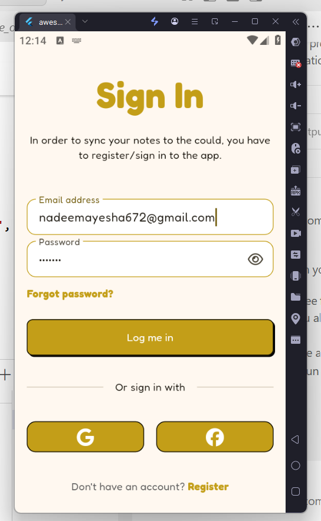
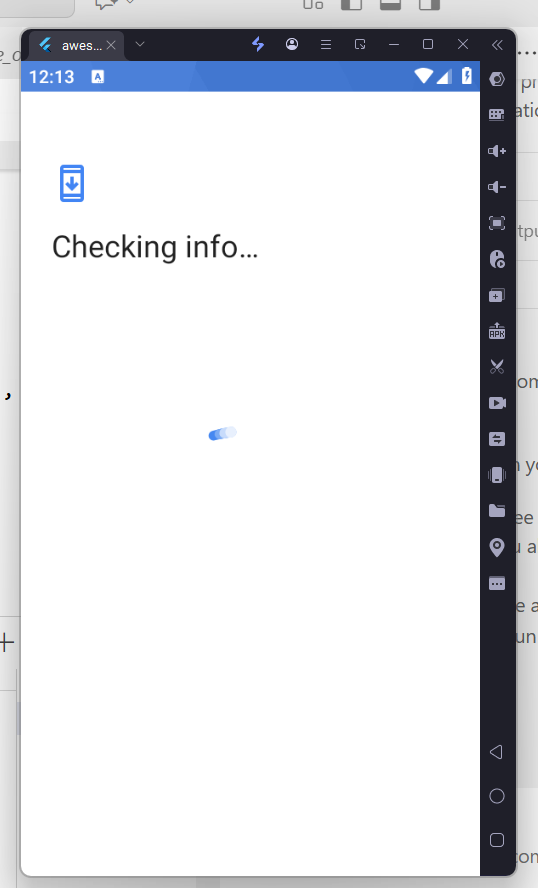
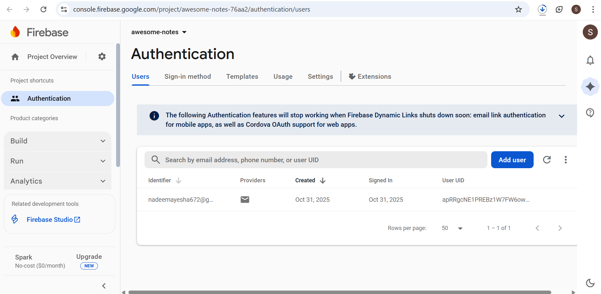
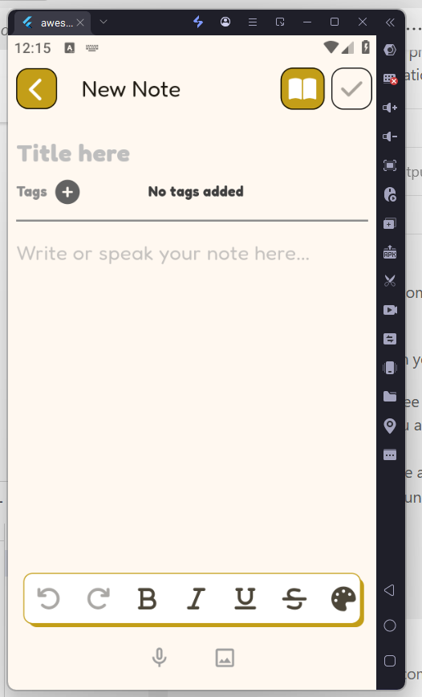
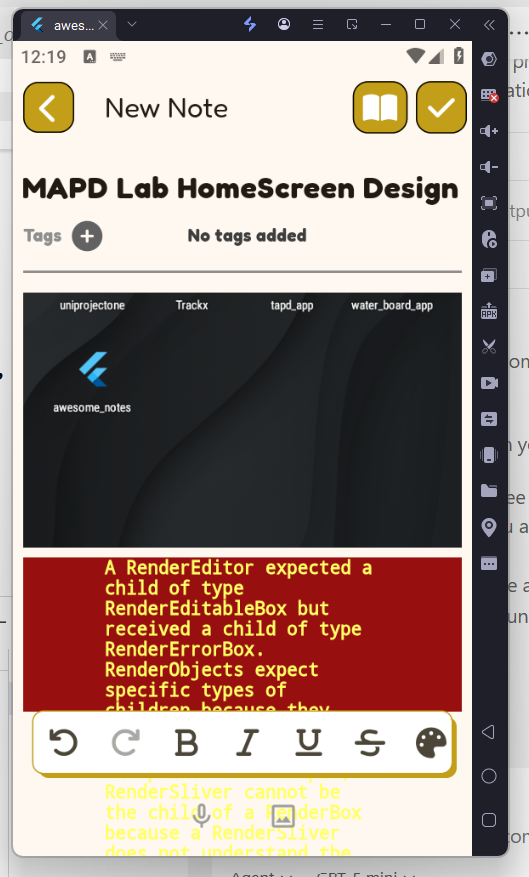
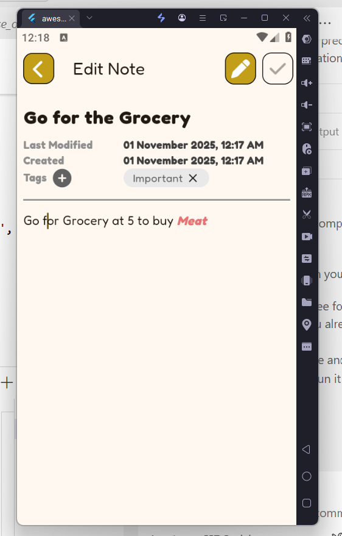
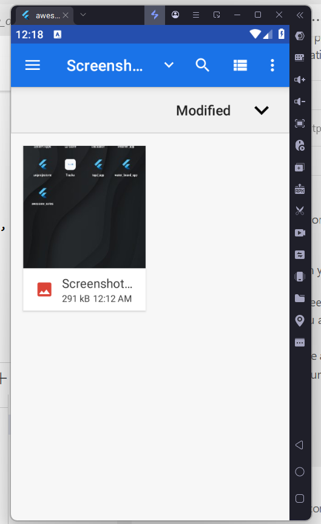

# AWESOME NOTES
### A Flutter-Based Smart Notes and To-Do Application

## Project Overview

**Awesome Notes** is a Flutter-based mobile application designed to help users manage their tasks and notes efficiently.  
It provides multiple note-taking options such as **text**, **voice**, and **image-based** notes, along with **category management** and **Firebase synchronization**.  
The app also supports **offline storage** using Hive, ensuring access to notes even without an internet connection.

## Objective

The main objective of this project is to design and develop a **smart notes and to-do application** that:
- Simplifies daily note-taking and task organization  
- Works both **online (Firebase sync)** and **offline (Hive storage)**  
- Provides **multiple input types** including text, voice, and image  
- Offers a **user-friendly interface** with formatting tools such as **bold** and **italic text**

## Scope of the Project

This project aims to assist students and professionals in managing their tasks and notes efficiently.  
The application can be extended for:
- Personal task management  
- Academic note organization  
- Office or team collaboration (future enhancement)  
- Reminders and notifications for important events  

## Tools & Technologies Used

Technology | Purpose 

1. **Flutter** : Cross-platform mobile development 
2. **Dart** : Programming language for Flutter 
3. **Firebase** : Cloud data storage and synchronization 
4. **Hive** : Local offline data storage
5. **Provider** : State management
6. **Speech-to-Text** : For recording voice notes 
7. **Image Picker** : For capturing and selecting images 
8. **Android Studio / VS Code** : Development environment

## System Requirements

- **Operating System:** Windows / macOS / Linux  
- **RAM:** Minimum 4 GB  
- **Software:** Flutter SDK, Android Studio / VS Code  
- **Device:** Android Emulator or Physical Device (Android 8.0 or higher)  
- **Internet:** Required for Firebase Sync  

## Setup Instructions

Follow these steps to set up and run the project on your system:

### Step 1 — Clone the Repository
git clone https://github.com/Syeda-Umaima/Awesome_Notes

### Step 2 — Navigate to the Project Folder
cd awesome-notes

### Step 3 — Install Dependencies
flutter pub get

### Step 4 — Configure Firebase
1. Create a new Firebase project in [Firebase Console]
2. Enable **Cloud Firestore** and **Authentication**.
3. Download the `google-services.json` file.  
4. Place it inside: android/app/

### Step 5 — Run the Application
flutter run

## 📦 Dependencies List

The project uses the following main dependencies:

yaml
dependencies:
  - flutter:
     - sdk: flutter
  - firebase_core: ^3.0.0
  - cloud_firestore: ^5.0.0
  - hive: ^2.2.3
  - hive_flutter: ^1.1.0
  - provider: ^6.0.5
  - image_picker: ^1.0.0
  - speech_to_text: ^6.1.0
  - flutter_tts: ^3.6.3
  - path_provider: ^2.1.2

## Major Features

 - **Firebase Sync**  Automatically syncs notes to the cloud 
 - **Offline Mode (Hive)**  Access notes without an internet connection 
 - **Task Categories**  Group notes and to-do items by category 
 - **Text Formatting**  Supports bold and italic text 
 - **Voice Notes**  Record and save spoken notes 
 - **Image Notes**  Add images directly from camera or gallery 
 - **Responsive UI**  Works on all device sizes 
 - **Clean Architecture**  Easy to maintain and extend 

## Working Principle

1. When the user creates a note, the app checks for internet availability.  
2. If **online**, the note is stored both in **Firebase** and **Hive**.  
3. If **offline**, the note is temporarily stored in **Hive** and later synced when online.  
4. The user can view, edit, delete, and categorize notes.  
5. Voice and image notes are stored as files linked to each note record.

---

## 📸 Screenshots

###  Authentication Screens
| Register | Register (Alt) | Sign In | Google Registration |
|-----------|----------------|----------|----------------------|
|  |  |  |  |

| Google Registration (Alt) | Firebase Console |
|----------------------------|------------------|
|  |  |

---

###  Main Screens
| Main Screen | Saved Notes | Sort Notes | Tag View |
|--------------|-------------|-------------|-----------|
|  |  |  |  |

---

###  Note Management
| New Note 1 | New Note 2 | New Note 3 | Update Note |
|-------------|-------------|-------------|--------------|
|  |  |  |  |

---

###  Image Input
| Image Input |
|--------------|
|  |

## Future Enhancements

- Add **reminders** and **push notifications**  
- Implement **note locking (PIN or biometrics)**  
- Add **calendar integration**  
- Support for **PDF or text export**  

## Conclusion

The **Awesome Notes** app successfully integrates multiple functionalities such as voice, image, and text-based note-taking, combined with cloud synchronization and offline access.  
It demonstrates efficient use of Flutter, Firebase, and Hive, providing a robust and scalable notes management solution suitable for both personal and professional use.

